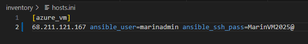
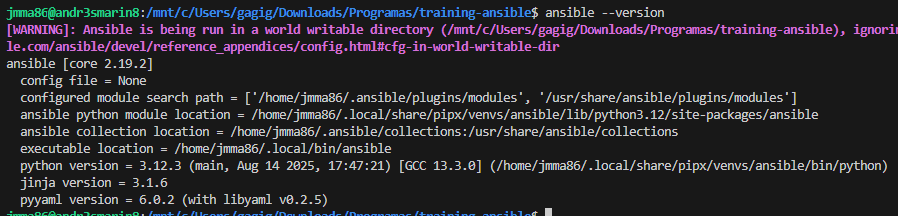
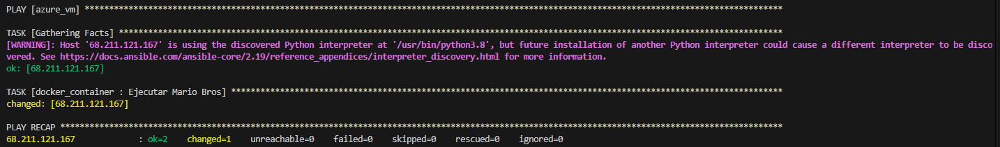
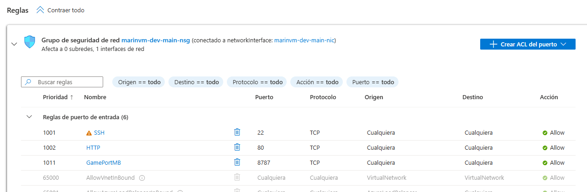
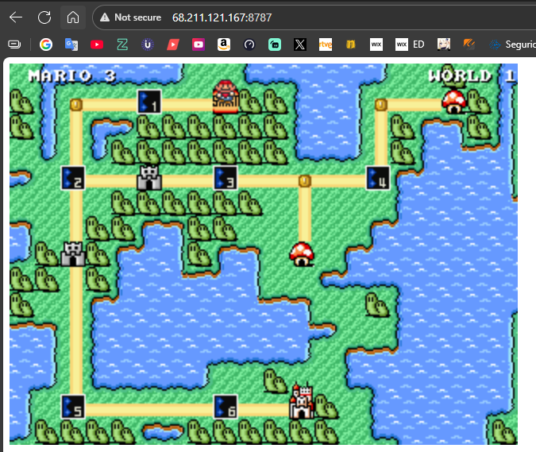

# Training-Ansible

## Estudiante

- Nombre: Juan Manuel Marín Angarita
- Código: A00382037

## Instrucciones

1. Se hizo un fork del repositorio.
2. Se modificaron los parámetros del archivo `hosts.ini` con la IP, usuario y contraseña de la VM de azure personal.

3. Se instaló Ubuntu con `wsl`, `python`, `pip`, `pipx` y por último `ansible`.

4. Se ejecutaron los dos scripts para instalar docker en la VM y subir la imagen de Mario Bros.

5. Se agregó el puerto de entrada 8787 en azure.

6. Se accedió al juego correctamente.

